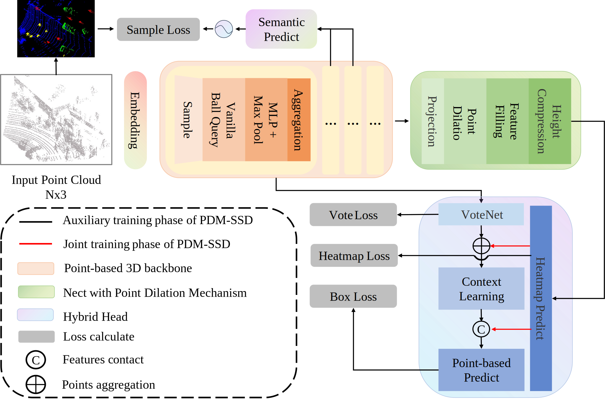
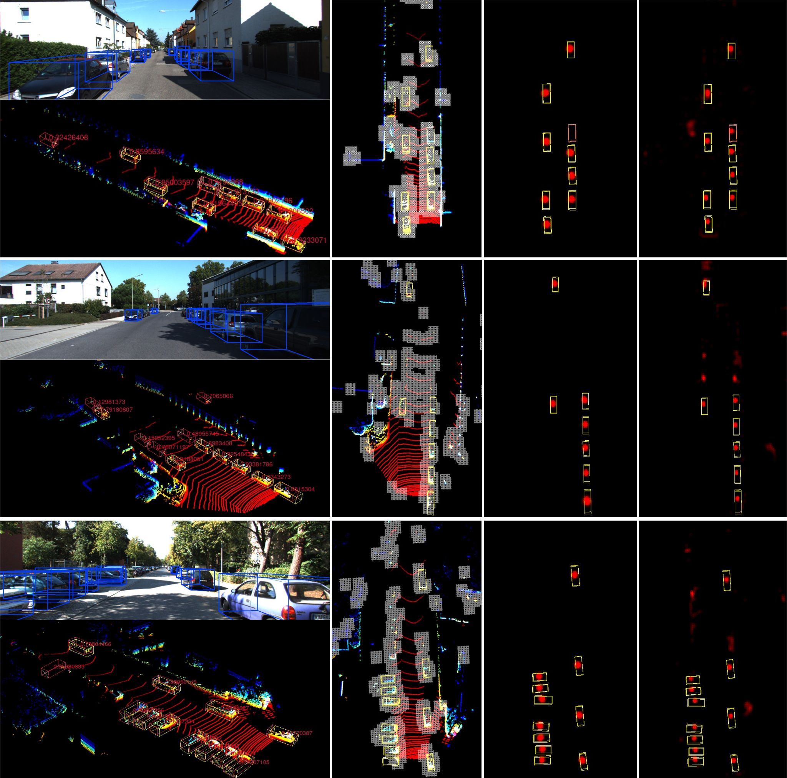
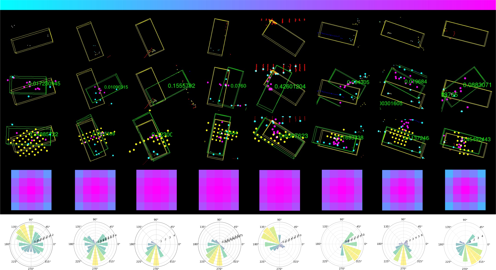
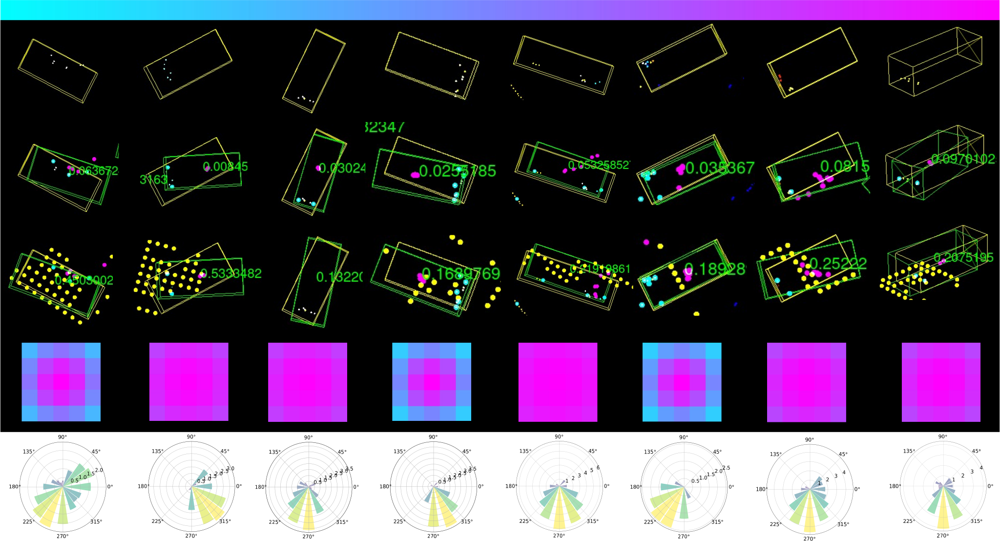

# PDM-SSD
PDM-SSD: Single-Stage 3D Object Detector With Point Dilation Mechanism

## Install

`git clone https://github.com/AlanLiangC/PDM-SSD.git`

All the *train* and *test* process are the same as ***OpenPCDet***.

## Result

