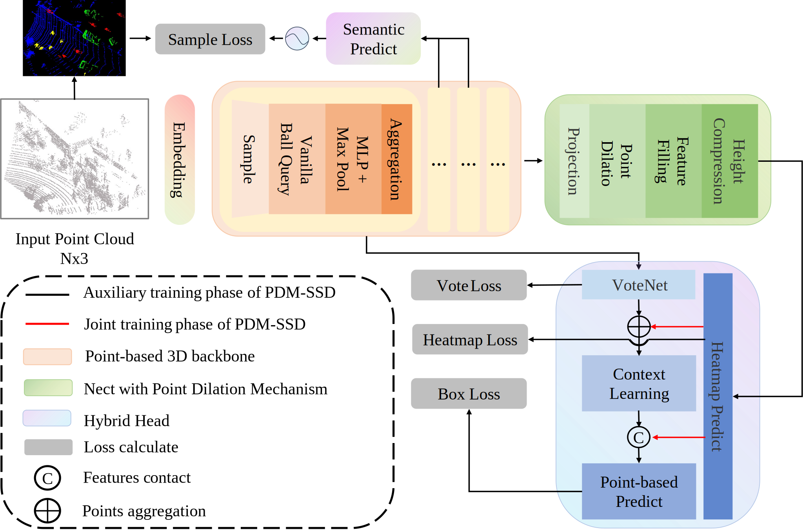
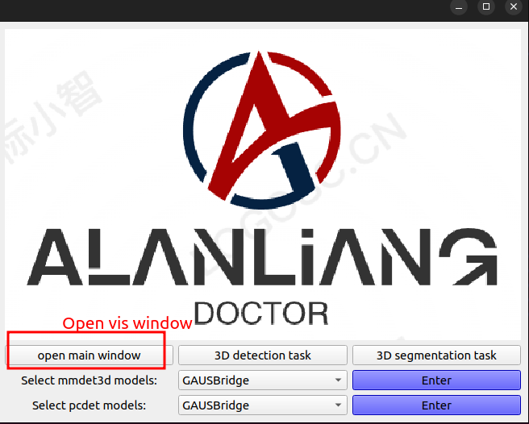
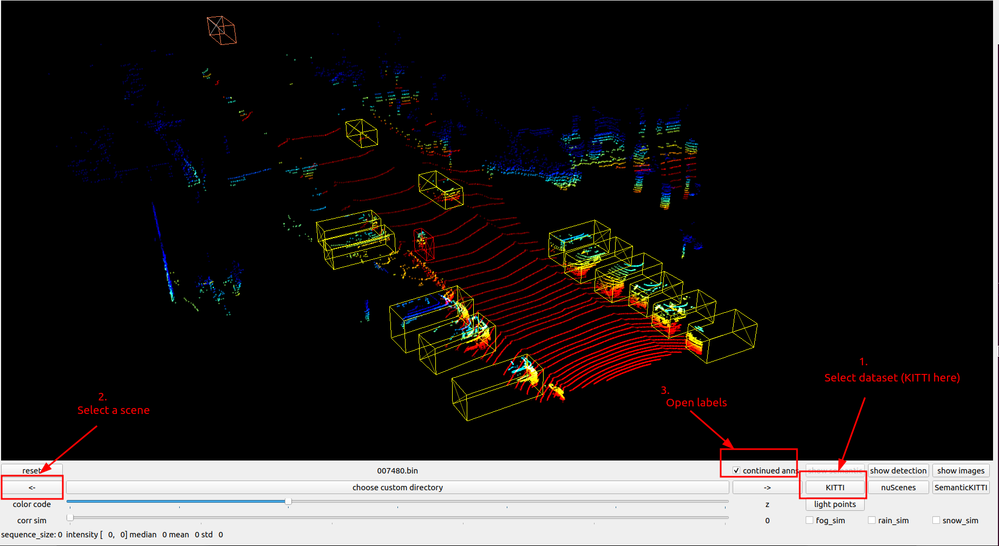
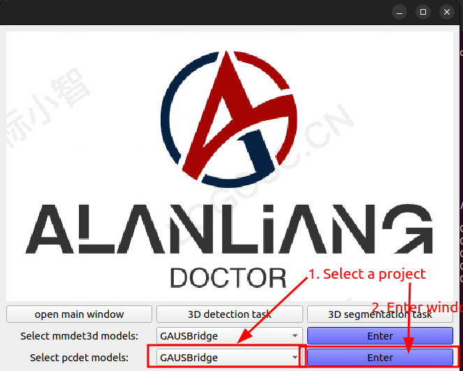
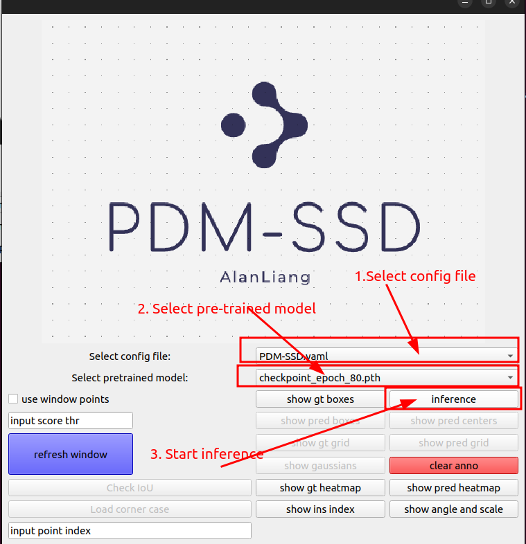
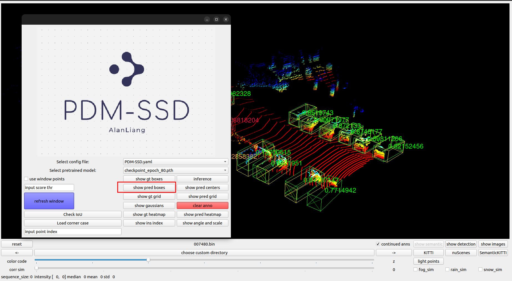
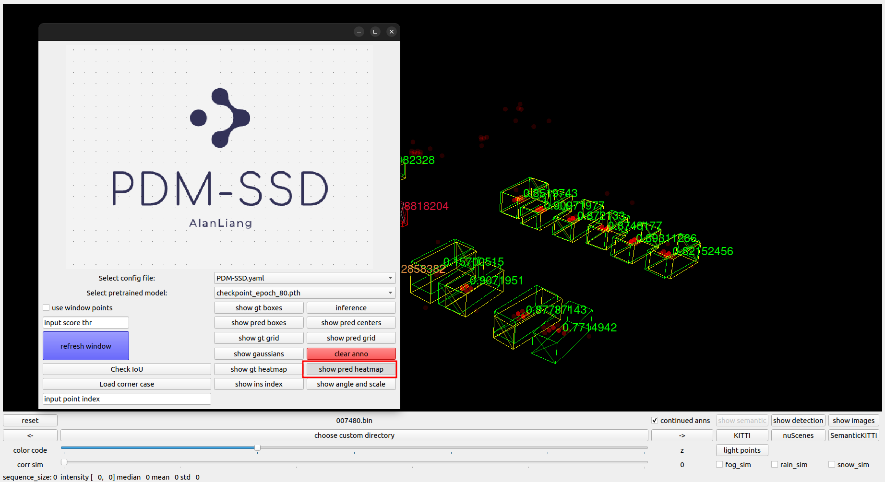
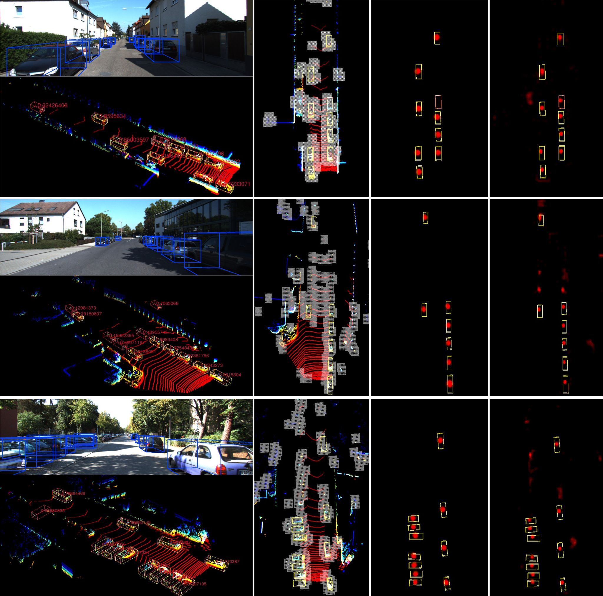
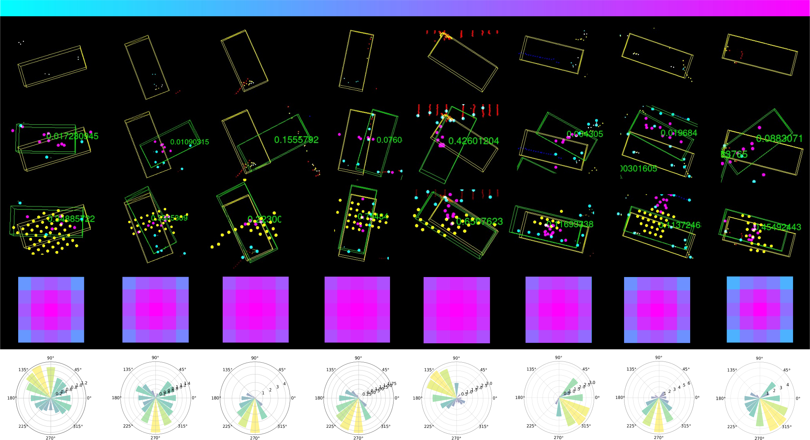
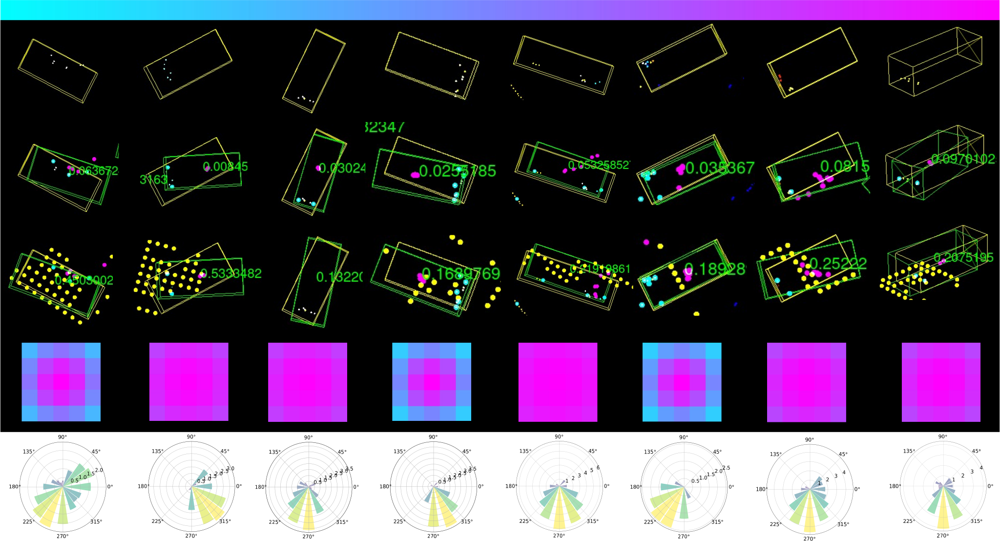

# PDM-SSD: Single-Stage 3D Object Detector With Point Dilation Mechanism

This repository is the code release of the paper *PDM-SSD: Single-Stage 3D Object Detector With Point Dilation Mechanism*.

## Introduction

we present a novel Point Dilation Mechanism for single-stage 3D detection (PDM-SSD) that takes advantage of two representations.

<p align="center">
  
</p>

**Abstract.** One of the important reasons why grid/voxel-based 3D object detectors can achieve robust results for sparse and incomplete targets in LiDAR scenes is that the repeated padding, convolution, and pooling layers in the feature learning process enlarge the model's receptive field, enabling features even in space not covered by point clouds. However, they require time- and memory-consuming 3D backbones. Point-based detectors are more suitable for practical application, but current detectors can only learn from the provided points, with limited receptive fields and insufficient global learning capabilities for such targets. In this paper, we present a novel Point Dilation Mechanism for single-stage 3D detection (PDM-SSD) that takes advantage of these two representations. Specifically, we first use a PointNet-style 3D backbone for efficient feature encoding. Then, a neck with Point Dilation Mechanism (PDM) is used to expand the feature space, which involves two key steps: point dilation and feature filling. The former expands points to a certain size grid centered around the sampled points in Euclidean space. The latter fills the unoccupied grid with feature for backpropagation using spherical harmonic coefficients and Gaussian density function in terms of direction and scale. Next, we associate multiple dilation centers and fuse coefficients to obtain sparse grid features through height compression. Finally, we design a hybrid detection head for joint learning, where on one hand, the scene heatmap is predicted to complement the voting point set for improved detection accuracy, and on the other hand, the target probability of detected boxes are calibrated through feature fusion. On the challenging KITTI dataset, PDM-SSD achieves state-of-the-art results for multi-class detection among single-modal methods with an inference speed of 68 frames. We also demonstrate the advantages of PDM-SSD in detecting sparse and incomplete objects through numerous object-level instances. Additionally, PDM can serve as an auxiliary network to establish a connection between sampling points and object centers, thereby improving the accuracy of the model without sacrificing inference speed. Our code will be available at [github](https://github.com/AlanLiangC/PDM-SSD.git).


## Getting Started

### Requirements
* Linux
* Python >= 3.6
* PyTorch >= 1.3
* CUDA >= 9.0
* CMake >= 3.13.2

### Installation
a. Clone this repository.
```shell
git clone https://github.com/AlanLiangC/PDM-SSD.git
cd PDM-SSD
```

b. Install `pcdet` toolbox.
```shell
pip install -r requirements.txt
python setup.py develop
```

### Data Preparation
a. Prepare datasets.
```
SASA
├── data
│   ├── kitti
│   │   ├── ImageSets
│   │   ├── training
│   │   │   ├──calib & velodyne & label_2 & image_2 & (optional: planes)
│   │   ├── testing
│   │   ├── calib & velodyne & image_2
├── pcdet
├── tools
```

b. Generate data infos.
```shell
# KITTI dataset
python -m pcdet.datasets.kitti.kitti_dataset create_kitti_infos tools/cfgs/dataset_configs/kitti_dataset.yaml
```

### Training
* Train with a single GPU:
```shell script
python train.py --cfg_file ${CONFIG_FILE}
```

* Train with multiple GPUs:
```shell script
sh scripts/dist_train.sh ${NUM_GPUS} --cfg_file ${CONFIG_FILE}
```

### Testing
* Test a pretrained model with a single GPU:
```shell script
python test.py --cfg_file ${CONFIG_FILE} --ckpt ${CKPT}
```

Please check [GETTING_STARTED.md](docs/GETTING_STARTED.md) to learn more usage of `OpenPCDet`.


## Acknowledgement
This project is built with `OpenPCDet` (version `0.6`), a powerful toolbox for LiDAR-based 3D object detection. Please refer to [OpenPCDet.md](OpenPCDet.md) and the [official github repository](https://github.com/open-mmlab/OpenPCDet) for more information.


## License
This project is released under the [Apache 2.0 license](LICENSE).

## Visualization

We have developed a visualization package for the openpcd project, which includes a visualization plugin for PDM-SSD, allowing readers to visually see the advantages of our method.

### Getting Start

#### Setup

1. Install all necessary packages.

```
conda install matplotlib numpy opencv pandas plyfile pyopengl pyqt pyqtgraph quaternion scipy tqdm -c conda-forge -y
pip install pyquaternion
```

2. Clone this repository (including submodules).

```
git clone git@github.com:MartinHahner/LiDAR_fog_sim.git --recursive
```

#### Usage

1. Open main interface.

```
python ALViewer.py
```


<p align="center">
  
</p>


2. Open the radar visualization window `open main windoe`.
3. Choose dataset, select scenario, and open annotation.


<p align="center">
  
</p>


4. Select projects and models that support the latest versions of the mmdet (>=2.0) and openpcd (0.6) projects.


<p align="center">
  
</p>

5. Open the project window, select the configuration file, choose the pre-trained model, and then perform inference.

<p align="center">
  
</p>

6. All functional buttons are located within the project sub-window, for details please refer to the paper.

For example:

- Visual detection results.

<p align="center">
  
</p>

- Heatmap of visualized predictions.

<p align="center">
  
</p>

All the results figures in the paper can be obtained with this plugin. Like:

- detect results

<p align="center">
  
</p>

- Issue 1

<p align="center">
  
</p>

- Issue 2

<p align="center">
  
</p>
